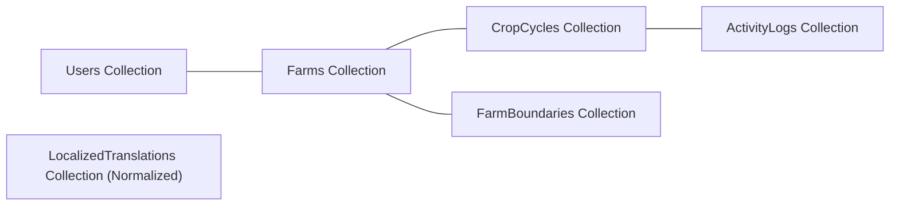

# Kisan Sathi Conceptual Data Model (MERN Web Stack)

This document specifies the MongoDB database model via Mongoose ODM for the Kisan Sathi MERN web platform, along with the historical SQL references preserved as superseded records.

---

## 1. Active MongoDB Document Schemas (Mongoose ODM)

Kisan Sathi implements a document-based data design inside MongoDB. Relationships are kept simple and modular, utilizing ObjectIDs and standard indexes.

### Collection: `users`
*   `_id`: ObjectID (Primary Key)
*   `phone_number`: String (Unique, Indexed)
*   `role`: String (e.g. `'farmer'`, `'buyer'`, `'admin'`)
*   `registered_at`: Date
*   `preferred_language`: String (e.g. `'hi'`, `'mr'`, `'en'`)

### Collection: `farms`
*   `_id`: ObjectID (Primary Key)
*   `user_id`: ObjectID (Ref -> users)
*   `name`: String
*   `size_acres`: Number
*   `soil_type`: String (e.g. `'black_cotton'`, `'red_sandy'`)
*   `water_source`: String (e.g. `'borewell'`, `'rainfed'`)
*   `gps_location`: 
    *   `type`: String (Must be `'Point'`)
    *   `coordinates`: [Number, Number] (Longitude, Latitude)
    *   *Index:* `2dsphere` index for location boundary operations.

### Collection: `crop_cycles`
*   `_id`: ObjectID (Primary Key)
*   `farm_id`: ObjectID (Ref -> farms)
*   `crop_type`: String (e.g. `'cotton'`, `'rice'`)
*   `variety`: String
*   `sowing_date`: Date
*   `stage`: String (ENUM: `'sowing'`, `'vegetative'`, `'flowering'`, `'harvest'`)
*   `status`: String (ENUM: `'active'`, `'harvested'`, `'failed'`)

### Collection: `activity_logs`
*   `_id`: ObjectID (Primary Key)
*   `crop_cycle_id`: ObjectID (Ref -> crop_cycles)
*   `activity_type`: String (ENUM: `'irrigation'`, `'fertilizer'`, `'weeding'`, `'pesticide'`)
*   `logged_date`: Date
*   `details`: Schema.Types.Mixed (flexible JSON payload, e.g. `{ fertilizer_name: "Urea", quantity_kg: 50 }`)

### Collection: `localized_translations` (Normalized)
*   `_id`: ObjectID (Primary Key)
*   `entity_type`: String (e.g. `'crop'`, `'disease'`, `'task'`)
*   `entity_id`: ObjectID (Ref to corresponding document)
*   `field_name`: String (e.g. `'name'`, `'treatment_details'`)
*   `language_code`: String (e.g. `'hi'`, `'mr'`, `'te'`)
*   `translated_value`: String
*   *Index:* Unique compound index on `{ entity_type: 1, entity_id: 1, field_name: 1, language_code: 1 }`.

---

## 2. RAG & Search Strategy
*   **MongoDB Text Search:** Text indexes are applied on agricultural manuals collections to perform lexical search matching without requiring external search databases.
*   **Geospatial Queries:** MongoDB GeoJSON operations (`$near`, `$geoWithin`) check coordinates relative to boundary polygons.

---

## 3. SUPERSEDED / HISTORICAL (PostgreSQL Reference)

> [!NOTE]
> The database schema described below is **superseded** and is retained purely for tracking the history of decisions when PostgreSQL/PostGIS/pgvector was considered.

### PostgreSQL Table Specifications (Superseded)
*   **`users`**: UUID PK, phone, otp_hash.
*   **`farmer_profiles`**: UUID PK, village coordinate (GEOMETRY Point, 4326).
*   **`farms`**: UUID PK, coordinates, `gps_location` (GEOMETRY Point, 4326).
*   **`rag_documents`**: BIGSERIAL PK, `embedding` (VECTOR(1536) via pgvector).
*   **`buyer_profiles`**: `village_coordinate` (GEOMETRY Point, 4326).
