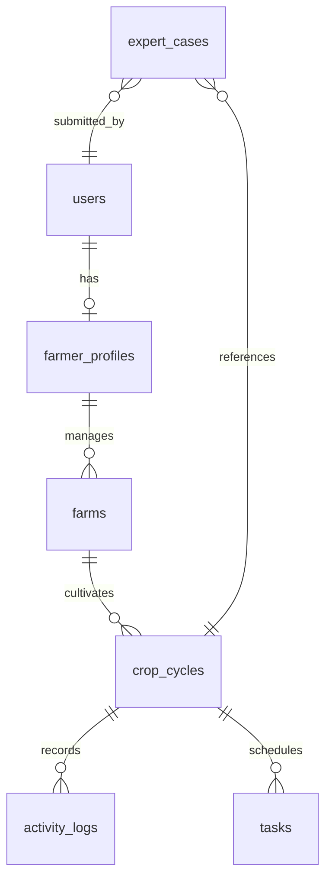

# Kisan Sathi Conceptual Data Model

> [!NOTE]
> **Superseded History:** This data architecture blueprint was written for the PostgreSQL database structure. It has been superseded by the locked P0 MongoDB database stack. The SQL schemas and PostgreSQL references remain for historical tracking only.

This document outlines the previous PostgreSQL database schema schema including geographic objects and vector embeddings.

---

## 1. Schema Tables & Relationships

---

## 2. Table Specifications

### `users`
*   `id`: UUID (Primary Key)
*   `phone`: VARCHAR(15) (Unique, Indexed)
*   `otp_hash`: VARCHAR(255)
*   `created_at`: TIMESTAMP WITH TIME ZONE

### `farmer_profiles`
*   `id`: UUID (Primary Key)
*   `user_id`: UUID (Foreign Key -> users.id)
*   `name`: VARCHAR(100)
*   `preferred_language`: VARCHAR(5) (ISO code, e.g. 'hi', 'mr')
*   `village_name`: VARCHAR(150)
*   `coordinate`: GEOMETRY(Point, 4326) (Fall-back location based on village center)
*   `experience_years`: INTEGER

### `farms`
*   `id`: UUID (Primary Key)
*   `profile_id`: UUID (Foreign Key -> farmer_profiles.id)
*   `name`: VARCHAR(100)
*   `size_acres`: DECIMAL(5,2)
*   `water_source`: VARCHAR(30) (ENUM: 'rainfed', 'borewell', 'canal', 'drip')
*   `soil_type_photo_class`: VARCHAR(50) (Classified from land photo: 'black_cotton', 'red_sandy', etc.)
*   `gps_location`: GEOMETRY(Point, 4326) (Collected via phone camera live capture)
*   `land_photo_url`: VARCHAR(255)

### `crop_cycles`
*   `id`: UUID (Primary Key)
*   `farm_id`: UUID (Foreign Key -> farms.id)
*   `crop_name`: VARCHAR(50) (e.g. 'cotton', 'rice')
*   `variety`: VARCHAR(50)
*   `sowing_date`: DATE
*   `expected_harvest_date`: DATE
*   `status`: VARCHAR(20) (ENUM: 'active', 'harvested', 'failed')

### `activity_logs`
*   `id`: UUID (Primary Key)
*   `crop_cycle_id`: UUID (Foreign Key -> crop_cycles.id)
*   `activity_type`: VARCHAR(30) (ENUM: 'irrigation', 'fertilizer', 'weeding', 'pesticide', 'harvest')
*   `logged_date`: TIMESTAMP WITH TIME ZONE (Supports retroactive dating)
*   `details`: JSONB (Stores specific quantities: `{fertilizer_type: "Urea", quantity_kg: 50}`)
*   `image_url`: VARCHAR(255) (Optional photo proof)

### `tasks`
*   `id`: UUID (Primary Key)
*   `crop_cycle_id`: UUID (Foreign Key -> crop_cycles.id)
*   `title`: VARCHAR(100)
*   `description`: TEXT
*   `due_date`: DATE
*   `status`: VARCHAR(20) (ENUM: 'pending', 'completed', 'postponed', 'skipped')
*   `rescheduled_from`: UUID (Self-reference tracking postponed tasks)

### `rag_documents`
*   `id`: BIGSERIAL (Primary Key)
*   `document_name`: VARCHAR(255)
*   `source_url`: VARCHAR(255)
*   `content_chunk`: TEXT
*   `embedding`: VECTOR(1536) (pgvector for semantic lookup)
*   `language`: VARCHAR(5)
*   `metadata`: JSONB (page numbers, manual revision dates)

### `expert_cases`
*   `id`: UUID (Primary Key)
*   `user_id`: UUID (Foreign Key -> users.id)
*   `crop_cycle_id`: UUID (Foreign Key -> crop_cycles.id)
*   `uploaded_image_url`: VARCHAR(255)
*   `ai_diagnosis`: VARCHAR(100)
*   `confidence_score`: DECIMAL(5,2)
*   `expert_notes`: TEXT
*   `expert_submitted_at`: TIMESTAMP WITH TIME ZONE
*   `status`: VARCHAR(20) (ENUM: 'pending', 'resolved')

### `weather_scenarios`
*   `id`: UUID (Primary Key)
*   `crop_cycle_id`: UUID (Foreign Key -> crop_cycles.id)
*   `forecast_date`: DATE
*   `precipitation_probability`: DECIMAL(5,2)
*   `expected_rain_volume_mm`: DECIMAL(5,2)
*   `scenario_matrix`: JSONB (Stores calculated utilities: `{early_harvest_val: 12000, wait_rain_val: 6000, wait_no_rain_val: 15000}`)
*   `created_at`: TIMESTAMP WITH TIME ZONE

### `localized_translations`
*   `id`: UUID (Primary Key)
*   `entity_type`: VARCHAR(50) (e.g. 'crop', 'disease', 'task')
*   `entity_id`: UUID (Foreign key referencing respective entities)
*   `field_name`: VARCHAR(50) (e.g. 'name', 'treatment_details')
*   `language_code`: VARCHAR(5) (e.g. 'hi', 'mr', 'te')
*   `translated_value`: TEXT (Translated content)
*   *Index:* Unique composite index on `(entity_type, entity_id, field_name, language_code)`.

### `buyer_profiles`
*   `id`: UUID (Primary Key)
*   `user_id`: UUID (Foreign Key -> users.id)
*   `company_name`: VARCHAR(150)
*   `contact_person`: VARCHAR(100)
*   `phone`: VARCHAR(15)
*   `operating_mandi`: VARCHAR(100)
*   `village_coordinate`: GEOMETRY(Point, 4326)

### `buyer_offers`
*   `id`: UUID (Primary Key)
*   `buyer_profile_id`: UUID (Foreign Key -> buyer_profiles.id)
*   `commodity`: VARCHAR(50)
*   `variety`: VARCHAR(50)
*   `min_grade`: VARCHAR(5) (e.g. 'A', 'B')
*   `buying_price_per_quintal`: DECIMAL(10,2)
*   `last_updated`: TIMESTAMP WITH TIME ZONE

### `community_posts`
*   `id`: UUID (Primary Key)
*   `user_id`: UUID (Foreign Key -> users.id)
*   `title`: VARCHAR(200)
*   `content`: TEXT
*   `image_url`: VARCHAR(255)
*   `crop_category`: VARCHAR(50)
*   `district`: VARCHAR(100)
*   `upvotes`: INTEGER DEFAULT 0
*   `created_at`: TIMESTAMP WITH TIME ZONE

### `community_comments`
*   `id`: UUID (Primary Key)
*   `post_id`: UUID (Foreign Key -> community_posts.id)
*   `user_id`: UUID (Foreign Key -> users.id)
*   `comment_text`: TEXT
*   `created_at`: TIMESTAMP WITH TIME ZONE

