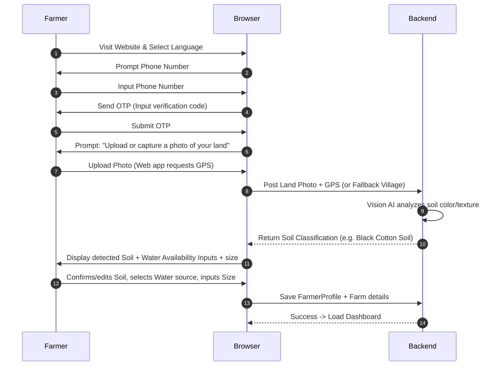
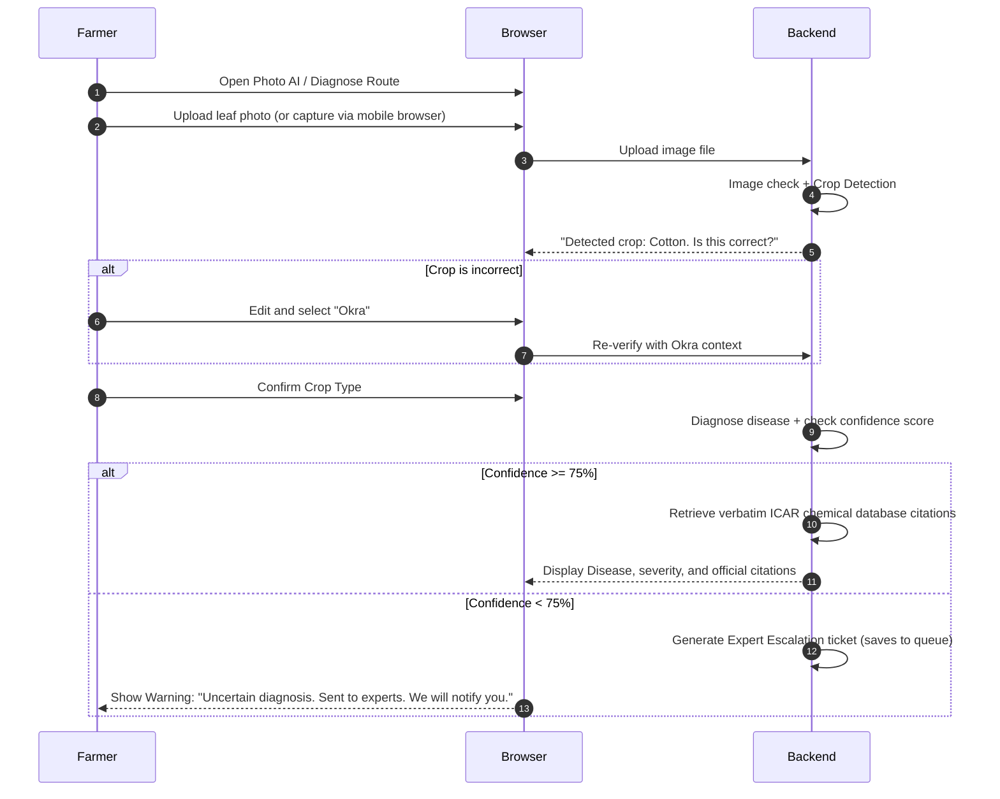
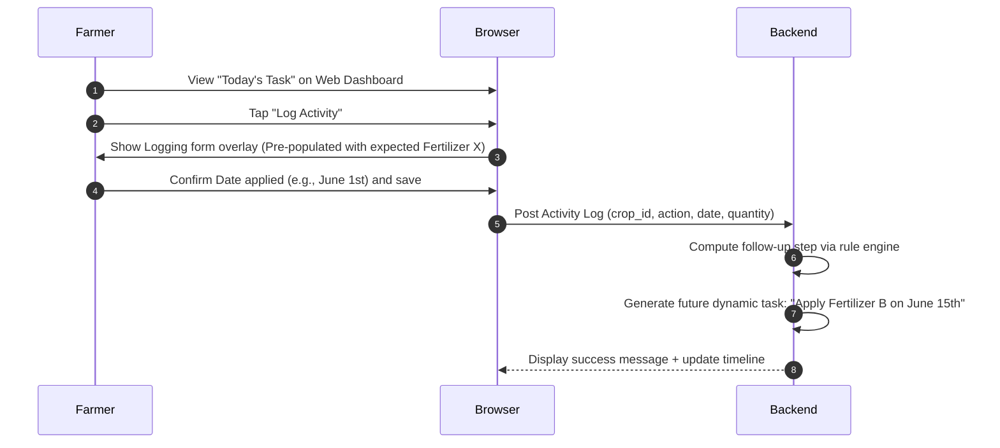
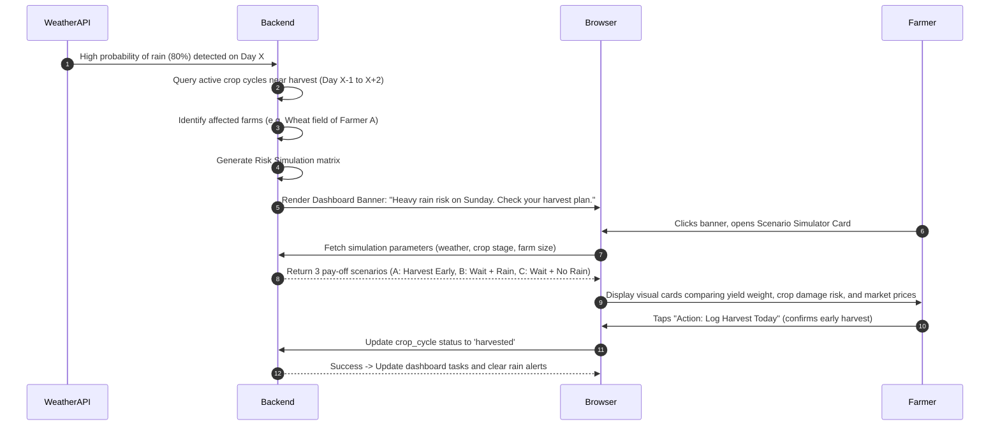

# Kisan Sathi User Flows (MVP Core)

This document outlines the core transactional user flows for the Kisan Sathi Web MVP.

## Flow 1: New Farmer Onboarding & Farm Setup

## Flow 2: Photo AI Crop Disease Diagnosis

## Flow 3: Smart Calendar Action Logging

## Flow 4: Scenario-Based Risk Analysis (Weather vs. Harvest)

